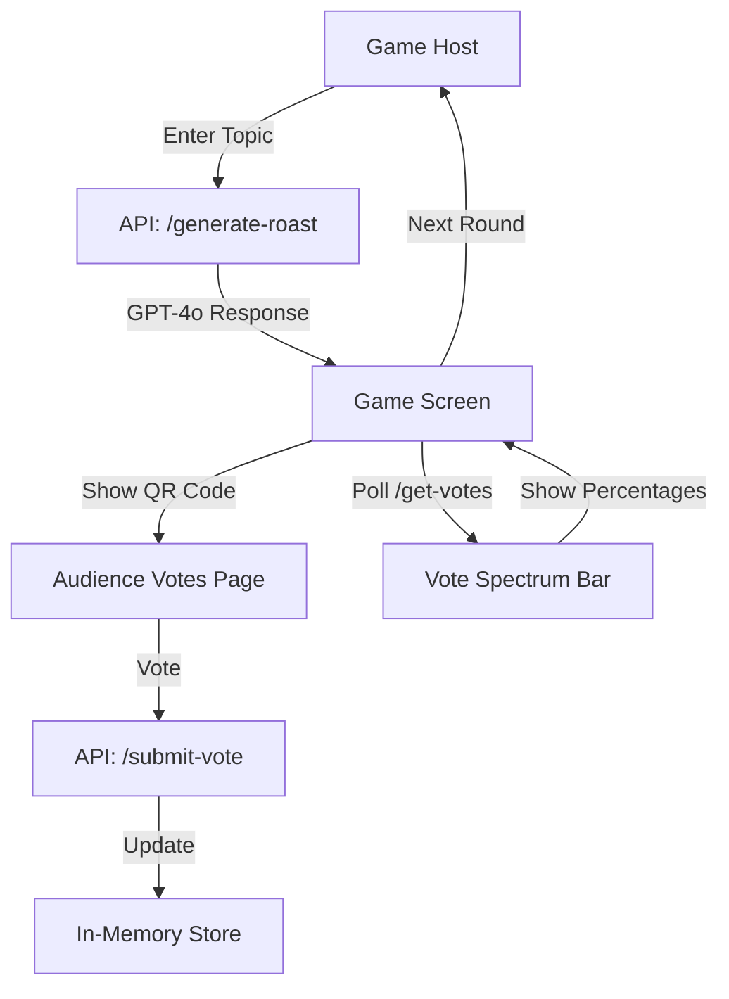

# 📄 Product Requirements Document (PRD)

## 🧠 Project Name
**RoastBot**

## 🎯 Objective
Build a live, interactive 3-round roast battle game where a human and AI take turns roasting a topic. After each round, the audience votes via a QR-accessible page. The winner is visually displayed through a vote spectrum bar. The app is built for a 4-hour hackathon and optimized for fun, speed, and impact.

## 🧩 Key Features

### 1. Game Flow
- 3 Rounds of roast battle
- Each round is based on a new **topic**
- **Human** enters a roast manually
- **AI Roast** is generated via GPT based on topic
- Roasts are displayed side-by-side on the main screen

### 2. Audience Voting
- A **QR Code** links to a `/vote` page
- Each audience member votes: 🤖 AI or 🔊 Human
- Votes are submitted via API and tallied live

### 3. Voting Spectrum Visualizer
- A horizontal **fill bar** shows the real-time proportion of votes
- Left: Human 🔊, Right: AI 🤖
- Updates live during voting
- Winner displayed after each round

### 4. Round Management
- Host clicks a button to start each round
- Voting is closed after a timer or manual action
- Final winner is shown at the end of 3 rounds

## 🏗 Tech Stack

| Layer      | Tech |
|------------|------|
| **Frontend** | React + Next.js |
| **Backend API** | Next.js API Routes |
| **LLM** | OpenAI GPT-4o |
| **State Storage** | In-memory JavaScript store (no DB) |
| **Voting** | Custom API routes, real-time polling |
| **Voice (stretch)** | Eleven Labs Text-to-Speech |
| **QR Codes** | `qrcode.react` or equivalent React library |

## 🧱 Architecture Overview



## 📁 Suggested File Structure

```
/pages
  index.tsx             // Main game screen
  vote.tsx              // QR audience voting page
  /api
    generate-roast.ts   // GPT roast generator
    submit-vote.ts      // Handle vote submission
    get-votes.ts        // Return vote tallies
    start-round.ts      // (Optional) Reset round data

/lib
  voteStore.ts          // In-memory game + vote state

/components
  GameScreen.tsx
  VotingBar.tsx
  QRCodeDisplay.tsx
  WinnerBanner.tsx

/utils
  gptPrompt.ts          // Roast prompt formatter
```

## 👥 Team Roles

| Member     | Responsibilities |
|------------|------------------|
| **Abhi**     | Frontend UI layout, roast panels, vote bar, round tracker |
| **Josh**     | Game logic + state transitions (rounds, timing, reset) |
| **Trevor**   | API routes: roast gen, vote submit, vote tally |
| **Jeremiah** | QR vote page + vote submission form |
| **Jack**     | Voting spectrum bar (polling + animation) |
| **Kanishk**  | GPT prompt engineering + Eleven Labs (stretch goal) |

## 🎯 MVP Success Criteria

✅ Human and AI each get one roast per round  
✅ Topic input triggers GPT roast generation  
✅ QR voting works on mobile devices  
✅ Votes are submitted and reflected in real-time  
✅ Visual vote spectrum shows current tally  
✅ Round winner is clearly shown  
✅ Final winner after 3 rounds

## 🚀 Stretch Goals (If Time Allows)
- 🎙 AI roast spoken aloud with funny voice via Eleven Labs
- 🎉 Confetti and sound effects for winners
- 🧠 Themed rounds (e.g. "Roast like a pirate")
- 👤 Vote deduplication (one vote per device/IP)
- 📊 Vote history + analytics (using Supabase if reintroduced)

## 🧪 Testing Plan

| Component | Test |
|----------|------|
| GPT Roast | Prompt returns funny, short response |
| Vote Page | Submits vote correctly via POST |
| Vote Bar | Reflects accurate proportions on main screen |
| Round Logic | Transitions cleanly between rounds |
| QR Scan | Links correctly to `/vote` on all mobile devices |

## 📆 Timeline (4-Hour Hackathon)

| Time | Milestone |
|------|-----------|
| 0:00–0:30 | Set up repo, skeleton UI, APIs scaffolded |
| 0:30–1:30 | Implement GPT roast gen, voting bar, and vote API |
| 1:30–2:30 | Integrate round logic + UI + vote tally |
| 2:30–3:30 | Polish UI, test flows, fix bugs |
| 3:30–4:00 | Stretch goals + prepare demo 💥 |
